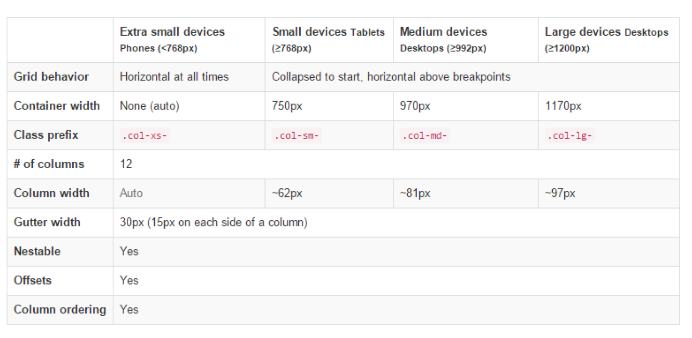
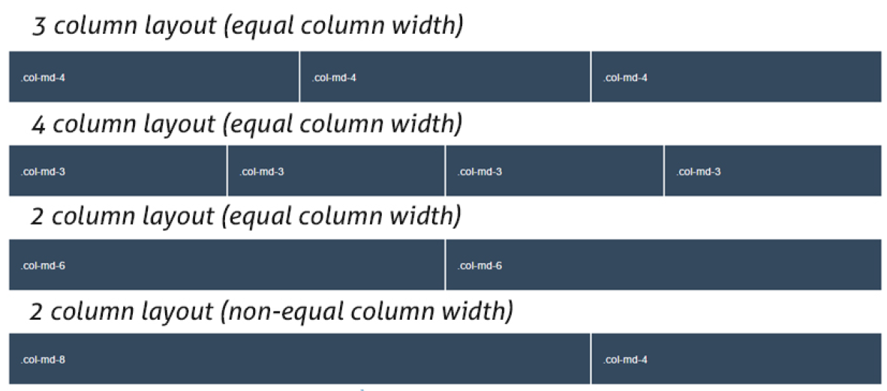
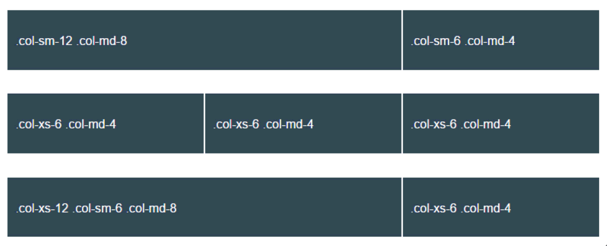
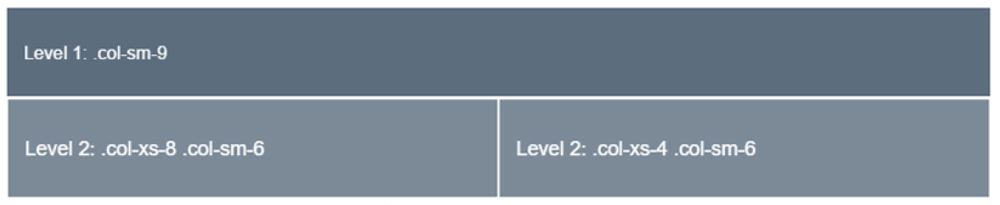

# Grids

* For proper alignment and padding, rows must be wrapped within a .container or .container-fluid respectively for fixed-width and full-width.

* Use rows to create horizontal groups of columns.

* Only columns may be immediate children of rows, and content should be placed within columns.

* Bootstrap offers a lot of classes to set up layouts fast, classes like .row to create a new row or .col-xs-4 to create a small sized column equal to 1/3 of the container.

* Gutters between columns are created via padding.

* The negative margin is why the examples below are outdented. It’s so that content within grid columns is lined up with non-grid content.

* Grid columns are created by specifying the number of twelve available columns you wish to span. It could wither be 12 columns by using for example .col-sm-1 or three .col-sm=4 or six .col-sm-2 etc.

* When trying to add more than 12 columns within a row, the extra columns will automatically wrap onto a new line.

```
<!DOCTYPE html>
<html lang="en">
<head>
<meta charset="utf-8">
<meta http-equiv="X-UA-Compatible" content="IE=edge">
<meta name="viewport" content="width=device-width, initial-scale=1">
<title>Bootstrap Basic Template</title>
<!-- Bootstrap -->
<link href="css/bootstrap.min.css" rel="stylesheet">
</head>
<body>


<!-- jQuery (necessary for Bootstrap’s JavaScript plugins) -->
<script src="https://ajax.googleapis.com/ajax/libs/jquery/1.11.3/jquery.min.js"></  -
script>
<!-- Include all compiled plugins (below), or include individual files as needed -->
<script src="js/bootstrap.min.js"></script>
</body>
</html>
```

## Grid across multiple devices



Inside each row I can create until 12 columns.

Example 1:

```
<div class="container">
    <div class="row">
        <div class="col-md-1">.col-md-1</div>
        <div class="col-md-1">.col-md-1</div>
        <div class="col-md-1">.col-md-1</div>
        <div class="col-md-1">.col-md-1</div>
        <div class="col-md-1">.col-md-1</div>
        <div class="col-md-1">.col-md-1</div>
        <div class="col-md-1">.col-md-1</div>
        <div class="col-md-1">.col-md-1</div>
        <div class="col-md-1">.col-md-1</div>
        <div class="col-md-1">.col-md-1</div>
        <div class="col-md-1">.col-md-1</div>
        <div class="col-md-1">.col-md-1</div>
    </div>
</div>

```

In order to have some visual results, add the following CSS to emphasize the grid:

```
<style type="text/css">
    .col-md-1, .col-md-2, .col-md-3, .col-md-4, .col-md-6, .col-md-8 {
    background-color: #34495e;
    color: white;
    line-height: 5em;
    border: 1px solid white;
    height: 5em;
    }
</style>
```

In the same way, we can define, 2, 3, 4, 6 or combinations like 8 and 4 columns.

```

Example 2:

<div class="container">
    <div class="row">
        <div class="col-md-4">.col-md-4</div>
        <div class="col-md-4">.col-md-4</div>
        <div class="col-md-4">.col-md-4</div>
    </div>
    <div class="row">
        <div class="col-md-3">.col-md-3</div>
        <div class="col-md-3">.col-md-3</div>
        <div class="col-md-3">.col-md-3</div>
        <div class="col-md-3">.col-md-3</div>
    </div>
    <div class="row">
        <div class="col-md-6">.col-md-6</div>
        <div class="col-md-6">.col-md-6</div>
    </div>
    <div class="row">
        <div class="col-md-8">.col-md-8</div>
        <div class="col-md-4">.col-md-4</div>
    </div>
</div>
```



## Multiple device support.

You can define multiple different behaviours based on the device you want to have the grid for.

Example 3:

```
<div class="row">
    <div class="col-sm-12 col-md-8">.col-sm-12 .col-md-8</div>
    <div class="col-sm-6 col-md-4">.col-sm-6 .col-md-4</div>
</div>
<div class="row">
    <div class="col-xs-6 col-md-4">.col-xs-6 .col-md-4</div>
    <div class="col-xs-6 col-md-4">.col-xs-6 .col-md-4</div>
    <div class="col-xs-6 col-md-4">.col-xs-6 .col-md-4</div>
</div>
<div class="row">
    <div class="col-xs-12 col-sm-6 col-md-8">.col-xs-12 .col-sm-6 .col-md-8</div>
    <div class="col-xs-6 col-md-4">.col-xs-6 .col-md-4< /div >
</div>
```

In the first row, we have defined a 2 column layout made of 8 columns (.col-md-8) and 4 columns (.col-md-4) to divide
width for the medium sized devices. Then we’ve also added another class defining the lyout of each column on small sized
devices, in this case, the first column will fill up the whole row (.col-sm-12) and consequently the send columns will end up
on a new line with a half width of a row (.col-sm-6). It goes the same way for the two other cases, ecen when using three
classes, to define three different layouts based on the grid breakpoints. If a column or some of them fill up the whole row with
columns (12), the remaining ones (if any) will normally enter a new line.

## Offsetting and Nesting columns

What if you didn’t want a clear layout that fills up all the row? Well, you can set up columns just the way you want by using
column offsets.

example 4:

```
<div class="row">
    <div class="col-md-8">
    .col-md-8
        <div class="row">
        <div class="col-sm-8 col-md-6">.col-sm-8 .col-md-6</div>
        <div class="col-sm-4 col-md-6">.col-sm-4 .col-md-6</div>
        </div>
    </div>
</div>
```



